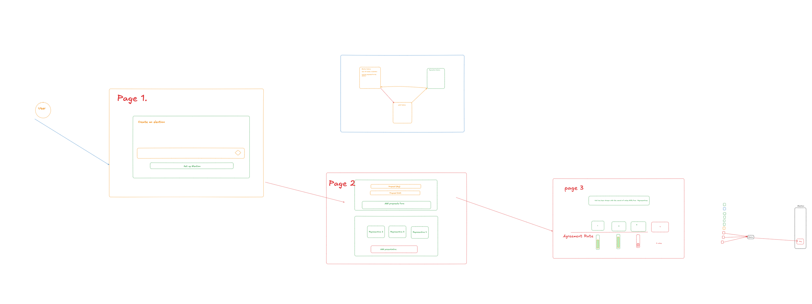

### Project Planning and Architecture Overview

#### Introduction

This document outlines the planning and architectural approach for the **Election App**, which aims to provide a seamless platform for managing elections, representatives, and public participation. The application is designed with scalability, maintainability, and modularity in mind, leveraging modern technologies and best practices.

---



### Project Overview

The application is divided into three core features:

1. **Election Feature**: Handles the creation, management, and results of elections.
2. **Representative Feature**: Manages the representatives participating in the elections, including their nominations and profiles.
3. **Public Feature**: Facilitates public engagement, including voting and viewing election-related details.

Each feature is developed independently to maintain modularity, with shared reusable components and a consistent design system across the application.

---

### Architecture and Design

The app follows the **Feature-Sliced Architecture** pattern, organizing code into three distinct layers for each feature:

1. **Presentation Layer (UI)**:

   - Built using **React** (with **Next.js** as the framework).
   - Includes reusable UI components shared across the app and specific components tailored to each feature.
   - The pages are framework-agnostic, focusing on reusable, testable components.
   - Navigation is facilitated by a **Navbar**, allowing users to switch seamlessly between pages.

2. **Service Layer**:

   - Acts as the intermediary between the Presentation and Repository layers.
   - Controls application flow, handling validation, business logic, and redirection (e.g., validating paths or caching during Next.js actions).
   - Uses **Zod** for validation to ensure data integrity.
   - Includes hooks like `useStateAction` for efficient state management and form validation.

3. **Repository Layer**:
   - Manages database operations, built on **Drizzle ORM**.
   - Each feature has its own repository, enabling clear separation of concerns.
   - Seeding functions have been implemented for each table in the database, ensuring that data is seeded in chronological order.

---

### Current Progress

1. **UI Development**:

   - Designed reusable UI components.
   - Built feature-specific UI components.
   - Created a **Navbar** to navigate between the four pages of the app.

2. **Feature Implementation**:

   - Developed foundational layers for all three features (Election, Representative, Public).
   - Integrated Drizzle ORM for database interactions.
   - Prepared features to scale independently as the project evolves.

3. **Database**:

   - Implemented seed functions for all tables.
   - Designed the schema to ensure chronological and logical data relationships.

4. **Validation**:
   - Leveraged **Zod** for schema validation.
   - Currently exploring moving validation logic to the Service layer for better separation of concerns.

---

### Challenges and Future Improvements

1. **Validation in Service Layer**:

   - Transitioning validation logic from the UI layer to the Service layer while ensuring compatibility with **Next.js** actions and efficient redirection/caching.

2. **Scalability**:

   - Preparing features for independent scaling and further modularization.

3. **Testing**:
   - Implementing thorough unit and integration tests for all layers.

---

### ReadMe

# Election App

## Overview

The Election App is a modular application for managing elections, representatives, and public participation. It is built with modern web technologies to ensure scalability, maintainability, and an excellent user experience.

## Features

1. **Election Management**:

   - Create and manage elections.
   - View election results.

2. **Representative Management**:

   - Nominate and manage representatives.

3. **Public Participation**:
   - Allow the public to vote and view election-related details.

## Architecture

The application follows **Feature-Sliced Architecture**, with a clear separation of concerns:

- **UI Layer**: Reusable and feature-specific components built with React.
- **Service Layer**: Controls application logic and validation.
- **Repository Layer**: Manages database operations with Drizzle ORM.

## Tech Stack

- **Frontend**: React, Next.js
- **ORM**: Drizzle ORM
- **Validation**: Zod
- **Database**: PostgreSQL

## Setup

1. **Install Dependencies**:

   ```bash
   npm install
   ```

2. **Run the Application**:

   ```bash
   npm run dev
   ```

3. **Seed the Database**:
   ```bash
   npm run seed
   ```

## Roadmap

1. Migrate validation to the Service layer.
2. Add caching and redirection logic for enhanced performance.
3. Expand the database schema to support additional features.
4. Implement comprehensive unit and integration testing.

---

This document reflects the project's current state and the steps being taken to ensure its growth and success. For more details, see the specific feature directories and documentation.

# Final assignment v2.2

You will build a voting application to visualize the impact of your vote in a representative democracy.

The challenge will focus on code quality and how to vertically slice your features.

Seeding relevant data will also be of importance.

## Background

You will build an app for a representative democracy where a crowd of public voters will be represented by a smaller group of professional representative voters.

The representative voters will place all their public votes they have gained when voting on a choice in an election.

An election will have multiple choices to vote on, and the choice with most public votes win.

The app should help us understand how well the public voters agrees with their representative by providing useful statistics.

---

## Specification

### Representative voters management

1. There should be a list of registered representative voters that the public can place their vote on.
2. Representatives can be added to the list. They should have a name and email. Email needs to be unique.

### Public voting on representatives

1. Public voters can vote for a new representative at any point in time without the need of a public election.
2. Elections created before the public vote on a representative are not affected.

### Public preference statistics

1. Public voters can select an election choice that they prefer. This will let the representatives know how well their votes agree with their public voters’ preferences. Public preferences are not part of the actual voting, and are only used as statistical information.
2. Each representative has these public statistics:
   1. How many public votes the representative has gained.
   2. The agreement rate at which the public voters preferred the same choice that their representative voted on.
3. There should be an average agreement rate between the representatives and public voters for each election.

### Elections management

1. There should be a list of elections from latest to oldest.
2. Users can create an election to vote for.
3. Users can mark an election as concluded. Voting is then done.

### Election voting

1. Representative voting is publicly available information.
2. The public should be able to see how many votes a representative gained. The identities of the public voters should be protected.

### Election results

1. An election should show the number of public votes that got placed on each choice.
2. It should be clear which choice had the most number of public votes, and thus is the winning choice.
3. Each election should show a list with the representatives that voted, what they voted on, and how many public votes they voted with.
4. Each election should show the agreement rate for each representative.

### Seeding data

1. The application should seed up relevant data for a time span of 4 years so the application makes sense for someone who visits it. Seeding should be done via the service layer and it should be applied when running `npm run seed`.

---

## Example

Representative Andrea has 10 public votes.
Representative Beatrice has 20 public votes.

An election is created to decide between cats or dogs being allowed at the office.

Andrea votes Cats. Cats gets 10 public votes.
Beatrice votes on Dogs. Dogs gets 20 public votes.

The choice of dogs win with 20 public votes.

Andrea's public voters indicate their preferences with 5 people preferring cats and 5 dogs.
Andrea gets an agreement rate of 50% on this election.

Beatrice's 20 public voters all prefers cats.
Beatrice gets an agreement rate of 0% on this election.

---

## Requirements

- Tech stack: Next.js, TypeScript, Drizzle, Postgres, Zod, ESLint, Prettier.
- A readme explaining your big-picture plan.
- A GitHub planning board with sprint goals (done columns) where it's simple to understand how you divided your work in larger chunks. _Do not miss this requirement, as it would mean that you need to write a whole new project just to be able to plan it properly._
- Good UI design, including good choice of font, color, responsive layout, and component design. The design does not need to be original. Just high quality.
- Semantic HTML.
- Tidy code.
- Feature sliced architecture.
- Routing layer separated from the service layer.
- Functional core separated from the imperative shell.
- All business logic should be tested with unit tests.
- Proper commits using micro-steps with clear expectations.

---

## Project scope limitations

- Authentication and access management are out of scope for this project. In this basic version, all users has full access to everything.
- Issues present in production mode will not be taken into account. The application should work in development mode (`npm run dev`).
- Error handling in server actions are out of scope as there’s very little information in Next.js’ documentation.
- There’s no notion of democratic parties in this assignment. The public votes will go straight to a single representative. In real life, the votes would go to a party.

## Notes on the final assignment

- The submission should represent the best you can do in this given timespan. Even if you can’t finish the entire assignment, give it your best attempt so you can get scored accurately!
- The specification and requirements are things that you should make extra sure to include, and failing to fulfill them will most likely lead to the submission being marked as a fail.
- Failed submissions will have one extra attempt during an upcoming weekend to complete unfinished work.
- Only send in code that represents your own code skills. We are not looking at assessing how well AI fails this test 🤖 Succeed on your own terms! Anything else is considered cheating, and no more attempts will be given to complete the assignment.
- This will be the main scoring point that represents your ability to code.

# election-app-nextjs
